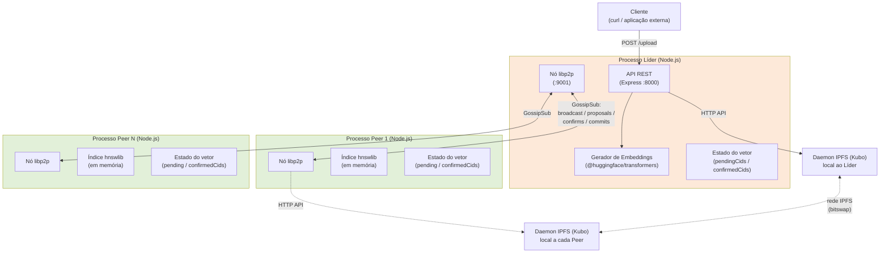
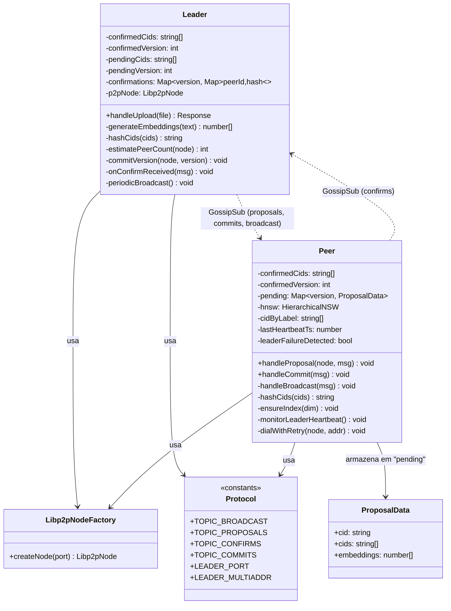
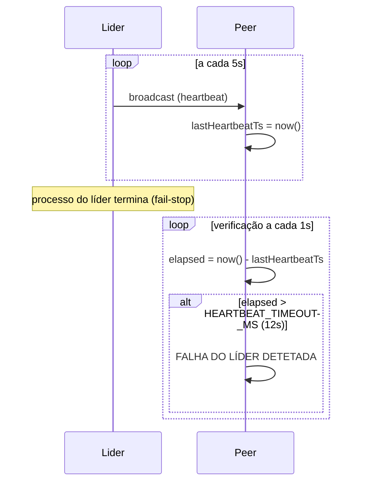

# Relatório — Sistema de Armazenamento Distribuído P2P

Sistemas Distribuídos — Trabalho Prático

## 1. Introdução

Este trabalho implementa um sistema distribuído peer-to-peer para armazenamento e replicação de documentos, com indexação semântica dos seus conteúdos através de *embeddings*. O sistema é composto por um conjunto de **peers**, um dos quais assume o papel de **líder** (estático nesta fase, sem eleição), e por **clientes** que interagem com o sistema exclusivamente através de uma API REST exposta pelo líder.

Quando um cliente submete um documento, o líder guarda-o na rede **IPFS** (via Kubo), gera os seus *embeddings* e propaga uma proposta de atualização a todos os peers. Os peers validam a proposta, calculam uma *hash* do vetor de documentos e devolvem-na ao líder. Quando a maioria dos peers confirma a mesma *hash*, o líder envia um *commit*, que os peers aplicam substituindo a sua versão local do vetor de CIDs e atualizando o seu índice vetorial em memória (usado para futura pesquisa por similaridade). O sistema inclui ainda deteção de falha do líder, através de um mecanismo de *heartbeat* baseado no modelo de falhas *fail-stop*.

O âmbito desta entrega cobre o **RF1 (Armazenamento de Ficheiros)** por completo, e a **Parte 1 do RNF3 (deteção de falha do líder)**. O RF2 (Pesquisa de Informação) e as restantes partes dos RNFs (eleição de líder, recuperação automática de peers, dinamicidade de peers, segurança fim-a-fim) ficam fora de âmbito desta entrega, conforme delimitado no planeamento do trabalho.

### 1.1 Tecnologias utilizadas

| Componente | Tecnologia |
|---|---|
| Linguagem/runtime | Node.js (ESM) |
| Gestão de peers / routing | [libp2p](https://libp2p.io/) (transporte TCP, `noise`, `yamux`, `identify`, `ping`) |
| Comunicação entre peers | GossipSub (pub/sub do libp2p), sobre 4 tópicos de aplicação |
| Descoberta/routing distribuído | Kademlia DHT (`@libp2p/kad-dht`) |
| Armazenamento de ficheiros | IPFS — daemon Kubo local, acedido via `kubo-rpc-client` (API HTTP) |
| API para clientes externos | REST (Express) |
| Geração de *embeddings* | `@huggingface/transformers` (modelo `all-MiniLM-L6-v2`, executado localmente, sem custo de API) |
| Indexação vetorial | `hnswlib-node` (equivalente ao FAISS pedido no enunciado — ver secção 3.6) |

## 2. Arquitetura da Solução em UML

### 2.1 Diagrama de Componentes / Implantação

Cada elemento do grupo corre uma instância de peer (ou o líder, atualmente único e estático). O líder acumula os papéis de líder de consenso e de ponto de entrada REST para clientes; todos os nós (líder incluído) correm o seu próprio daemon Kubo local.



### 2.2 Diagrama de Classes

O código é organizado por módulos (não classes no sentido estrito de JavaScript), mas o diagrama seguinte representa a sua estrutura lógica, estado e responsabilidades como se fossem classes, para facilitar a leitura da arquitetura.



### 2.3 Diagrama de Sequência — RF1 (submissão até ao commit)

```mermaid
sequenceDiagram
    actor Cliente
    participant Lider
    participant IPFS as IPFS (Kubo)
    participant PeerA
    participant PeerB

    Cliente->>Lider: POST /upload (ficheiro)
    Lider->>IPFS: ipfs.add(ficheiro)
    IPFS-->>Lider: CID
    Lider->>Lider: gera embeddings (all-MiniLM-L6-v2)
    Lider->>Lider: pendingVersion++, pendingCids += CID
    Lider-->>Cliente: 200 OK {cid, version}

    par Propagação via GossipSub (TOPIC_PROPOSALS)
        Lider->>PeerA: proposal {version, cid, cids, embeddings}
        Lider->>PeerB: proposal {version, cid, cids, embeddings}
    end

    PeerA->>PeerA: verifica conflito de versão
    alt sem conflito
        PeerA->>PeerA: pending.set(version, {cid, cids, embeddings})
        PeerA->>PeerA: hash = sha256(cids)
        PeerA->>Lider: confirm {version, hash} (TOPIC_CONFIRMS)
    else conflito de versão
        PeerA->>PeerA: regista conflito, ignora proposta
    end

    PeerB->>PeerB: verifica conflito de versão
    PeerB->>PeerB: pending.set(version, {cid, cids, embeddings})
    PeerB->>PeerB: hash = sha256(cids)
    PeerB->>Lider: confirm {version, hash} (TOPIC_CONFIRMS)

    Lider->>Lider: regista confirms, valida hash
    Lider->>Lider: peerCount = max(getSubscribers, getPeers)
    Lider->>Lider: maioria atingida? (validCount >= peerCount/2 + 1)

    par Commit via GossipSub (TOPIC_COMMITS)
        Lider->>PeerA: commit {version, cids}
        Lider->>PeerB: commit {version, cids}
    end

    PeerA->>PeerA: confirmedVersion = version; confirmedCids = cids
    PeerA->>PeerA: hnsw.addPoint(embeddings, label); cidByLabel.push(cid)
    PeerB->>PeerB: confirmedVersion = version; confirmedCids = cids
    PeerB->>PeerB: hnsw.addPoint(embeddings, label); cidByLabel.push(cid)
```

### 2.4 Diagrama de Sequência — RNF3 Parte 1 (deteção de falha do líder)



## 3. Implementação

### 3.1 Organização do projeto

O trabalho foi desenvolvido incrementalmente em pastas por sprint (`sprint2/`, `sprint3/`, `sprint5/`), cada uma acumulando o código da anterior, conforme a estrutura de entrega pedida. Esta pasta (`final/`) contém a versão consolidada — idêntica ao conteúdo do `sprint5/`, já que este foi o último sprint com alterações de código.

- `src/libp2p-node.js` — *factory* partilhada entre líder e peers para criar um nó libp2p (TCP, `noise`, `yamux`, `identify`, `ping`, GossipSub, Kademlia DHT).
- `src/protocol.js` — constantes do protocolo de aplicação: nomes dos 4 tópicos GossipSub e o endereço/porta fixos do líder.
- `src/leader.js` — API REST, integração com o IPFS, geração de *embeddings*, gestão do vetor pendente/confirmado, propagação de propostas, agregação de confirmações e lógica de *commit* por maioria.
- `src/peer.js` — subscrição aos tópicos, deteção de conflitos de versão, cálculo de *hash* e confirmação, aplicação de *commits*, indexação vetorial e deteção de falha do líder.
- `src/test-*.js` — scripts isolados usados para validar cada peça nova (ligação ao IPFS, arranque de um nó libp2p, geração de *embeddings*, funcionamento do `hnswlib-node`) antes de a integrar no fluxo principal. Não fazem parte do fluxo de produção, mas ficam no repositório como prova de validação incremental.

### 3.2 Comunicação entre peers (routing)

Em vez de WebSockets num modelo em estrela (abordagem observada num grupo de referência) ou de um *broker* externo como o MQTT, optámos por **libp2p com GossipSub**, tal como sugerido no enunciado. Definimos 4 tópicos de aplicação (`sdt/broadcast`, `sdt/proposals`, `sdt/confirms`, `sdt/commits`), cada um correspondendo a uma fase do protocolo de atualização do vetor de documentos. Os peers ligam-se diretamente ao líder (endereço estático, já que o líder ainda não é eleito) via `node.dial()`, com lógica de repetição (`dialWithRetry`) para tolerar arranques assíncronos entre processos.

### 3.3 Atualização do vetor de documentos (líder)

Ao receber um ficheiro via `POST /upload`, o líder:
1. Adiciona o ficheiro ao IPFS local (`kubo-rpc-client`), obtendo o CID;
2. Gera os *embeddings* do texto do documento;
3. Cria uma nova versão do vetor de CIDs (`pendingCids`), sem alterar a versão confirmada (`confirmedCids`);
4. Publica `[versão, CID, embeddings]` no tópico de propostas.

### 3.4 Confirmação e deteção de conflitos (peer)

Cada peer mantém o seu próprio `confirmedVersion`. Ao receber uma proposta, verifica se a versão recebida é exatamente `confirmedVersion + 1`; caso contrário, regista um conflito e não avança (resolução de conflitos fica documentada como trabalho futuro, conforme o enunciado permite nesta fase). Se a versão for válida, o peer guarda a proposta numa estrutura temporária (`pending`), calcula a *hash* SHA-256 do vetor de CIDs e devolve-a ao líder.

Um efeito colateral interessante desta escolha de desenho — sem *commit*, a versão confirmada nunca avança — é que, antes de implementarmos o Sprint 5, qualquer segunda submissão gerava sempre um conflito "esperado". Isto serviu como confirmação empírica de que a deteção de conflitos funcionava corretamente.

### 3.5 Commit por maioria e o desafio da estimativa de peers

O líder agrega as confirmações por versão. Quando o número de confirmações **válidas** (com *hash* correta) atinge a maioria, envia um *commit* a todos os peers e substitui a sua própria versão confirmada.

O próprio enunciado do card levanta o desafio: *"como obter o número aproximado de peers, tendo em conta que existe desacoplamento espacial?"* Na primeira implementação, usámos apenas `pubsub.getSubscribers(topic)` do GossipSub — e reproduzimos o problema exatamente como o enunciado antecipa: nos primeiros segundos após os peers se ligarem, o líder viu **zero** subscritores no momento do primeiro confirm (a informação de subscrição do GossipSub ainda não se tinha propagado), fazendo a maioria cair para 1 e disparando o *commit* antes do segundo peer conseguir responder.

A solução adotada foi combinar dois sinais — `getSubscribers()` (GossipSub) e `node.getPeers()` (ligações diretas do libp2p) — usando o maior dos dois valores. Como todos os peers dialam o líder diretamente, o número de ligações ativas é, na prática, mais fiável e imediato do que a propagação de metadados do *pub/sub*. Ainda assim, mantém-se uma aproximação, não uma contagem de membros centralizada e garantida.

### 3.6 Indexação vetorial (hnswlib-node)

Ao aplicar um *commit*, cada peer move os *embeddings* pendentes correspondentes para um índice `hnswlib-node` (métrica `cosine`, dado que os *embeddings* do modelo são normalizados), mantendo um mapeamento entre o rótulo interno (inteiro sequencial) e o CID do documento.

Não existe um *binding* Node.js maduro e não-nativo para o FAISS pedido no enunciado; o `hnswlib-node` foi a alternativa escolhida, por implementar o mesmo tipo de pesquisa aproximada por vizinhos mais próximos (ANN). A sua instalação exigiu, no Windows, resolver uma cadeia de dependências nativas de compilação (Python, Visual Studio Build Tools com Windows SDK, e uma versão atualizada do `node-gyp` compatível com Python 3.12+) — processo documentado no `README.md` de cada sprint a partir do Sprint 5, para referência de quem replicar o ambiente.

### 3.7 Deteção de falha do líder (RNF3, Parte 1)

O *broadcast* periódico que o líder já enviava desde o Sprint 1 (a cada 5 segundos) passou a servir também de *heartbeat*. Cada peer regista o instante da última mensagem recebida e um monitor, executado a cada segundo, compara o tempo decorrido com um limite configurável (`HEARTBEAT_TIMEOUT_MS`, 12 segundos por omissão). Ultrapassado esse limite, o peer regista a falha; se o líder voltar a responder, a recuperação é também registada. O sistema considera apenas falhas do tipo *fail-stop*, conforme especificado no requisito — não há deteção de comportamento bizantino.

### 3.8 Decisões de segurança e manutenção de dependências

Ao longo do desenvolvimento, cada nova dependência foi verificada com `npm audit` antes de ser aceite:
- Trocámos `@xenova/transformers` (1 vulnerabilidade crítica e 4 altas, via `onnxruntime-web`/`protobufjs` desatualizados) pelo sucessor mantido `@huggingface/transformers`;
- Usámos `overrides` no `package.json` para forçar uma versão corrigida do `sharp` (dependência transitiva do `@huggingface/transformers`), já que a própria biblioteca não tinha ainda atualizado essa dependência;
- Atualizámos o `multer` de 1.x (com vulnerabilidades conhecidas) para 2.x.

No final da implementação, o projeto tem **0 vulnerabilidades** reportadas pelo `npm audit`.

## 4. Conclusão

O sistema implementado cumpre integralmente o RF1 (armazenamento distribuído de documentos com propagação, confirmação por maioria e *commit*) e a Parte 1 do RNF3 (deteção de falha do líder). A arquitetura baseada em libp2p e GossipSub mostrou-se adequada para um protocolo de aplicação em camadas (*broadcast* → *proposals* → *confirms* → *commits*), e a validação incremental de cada peça (scripts `test-*.js`, testes manuais com múltiplos processos e, nalguns casos, com duas máquinas físicas distintas) permitiu identificar e corrigir problemas reais — nomeadamente a subestimação do número de peers via GossipSub, que o próprio enunciado antecipava como desafio.

### 4.1 Limitações da solução atual

- **Líder estático**: não existe eleição de líder (RNF4); a falha do líder é apenas detetada e registada, sem recuperação automática.
- **Resolução de conflitos de versão**: fica deliberadamente por implementar, conforme permitido pelos cards dos Sprints 3 e 5. Um peer que perca uma proposta ou um *commit* fica bloqueado nessa versão até ser reiniciado.
- **Sem redundância de *pinning***: o RNF3 Parte 2 (recuperação automática de ficheiros *pinned* por falha de um peer) e o algoritmo de seleção distribuída de peers responsáveis pelo *pinning* (mínimo de 2 réplicas) não foram implementados nesta entrega.
- **Capacidade fixa do índice vetorial**: o `hnswlib-node` é inicializado com uma capacidade máxima fixa (10 000 elementos), sem redimensionamento dinâmico automático.
- **Sem RF2**: a pesquisa semântica sobre os documentos indexados (uso do índice vetorial para responder a *prompts*, geração de resposta com um modelo de ML offline) está fora do âmbito desta entrega.
- **Segurança**: não foi implementada autenticação, autorização, nem cifragem/assinatura das mensagens entre peers (RNF6) — a comunicação assume uma rede de confiança mútua entre participantes.
- **Dependência nativa problemática**: o `hnswlib-node` exige um conjunto de ferramentas de compilação nativa (Python, Visual Studio Build Tools, Windows SDK) cuja instalação se revelou consideravelmente mais trabalhosa do que a de qualquer outra dependência do projeto — um ponto a favor de, em trabalho futuro, se avaliar uma alternativa em JavaScript puro (sem compilação nativa) caso a portabilidade entre máquinas se torne prioritária.

### 4.2 Possíveis melhorias e funcionalidades futuras

- Implementar a eleição de líder (RNF4), completando o ciclo iniciado pela deteção de falhas do RNF3 Parte 1.
- Implementar a recuperação automática de ficheiros *pinned* após falha de um peer, e o algoritmo distribuído de seleção de peers responsáveis pelo *pinning* (RNF3 Parte 2 e regras do RF1).
- Implementar a resolução de conflitos de versão nos peers, atualmente apenas detetados e ignorados.
- Completar o RF2 (pesquisa semântica), aproveitando o índice `hnswlib-node` já construído nesta entrega.
- Adicionar segurança de comunicação (RNF6): autenticação mútua entre peers e cifragem das mensagens GossipSub, hoje transmitidas em JSON não cifrado ao nível da aplicação (a camada de transporte do libp2p já cifra com `noise`, mas não existe autorização aplicacional).
- Avaliar uma migração para uma implementação de indexação vetorial 100% JavaScript, eliminando a dependência de ferramentas de compilação nativa e simplificando a instalação em novas máquinas.
